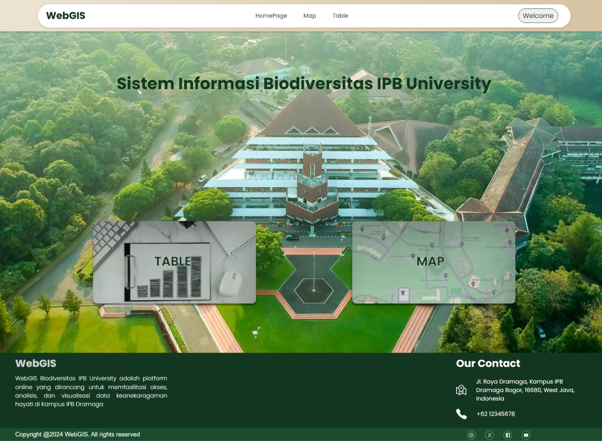

# Website Geospatial Information System (WebGIS) IPB University

WebGIS Biodiversitas IPB University adalah sebuah website yang dirancang khusus untuk memfasilitasi akses, analisis, dan visualisasi data keanekaragaman hayati di Kampus IPB Dramaga. Platform ini mengintegrasikan teknologi Geographic Information System (GIS) yang memungkinkan pengguna untuk melihat dan memahami distribusi serta pola keanekaragaman hayati dengan cara yang interaktif dan mendetail. Melalui WebGIS ini, peneliti, mahasiswa, dan pengunjung dapat dengan mudah mengakses informasi tentang berbagai spesies flora dan fauna yang ada di kampus, serta mendapatkan insight tentang habitat dan ekosistem mereka. Ini juga menjadi alat yang penting dalam mendukung penelitian dan kegiatan konservasi di universitas, serta memberikan sarana pendidikan yang kaya akan informasi bagi masyarakat luas.

## Documentation

## Tim Front-end

| Nama                     | NIM         |
|--------------------------|-------------|
| Malikus Syafaadi Nurfaza | G6401211121 |
| Illinia Malika Putri     | G6401211103 |
| Muhammad Khalil Adha     | G6401211060 |
| Nechita Samantha         | G6401211043 |
| Bella Agama              | G6401211038 |
| Fatha Ariya Prasetya     | G6401211078 |

## Tim Back-end

| Nama                     | NIM         |
|--------------------------|-------------|
| DAFFA NOFIANSYAH         | G6401211098 |
| Medina Fitri Maulida     | G6401211096 |
| NISMARA MAYZALIA         | G6401211027 |
| Ester Bina Br. Damanik   | G6401211030 |
| Giras Arya Ichsani       | G6401211047 |
| Fathan Abdul Mu'ti       | G6401211020 |

